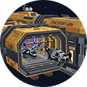
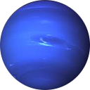
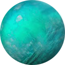
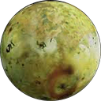
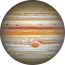
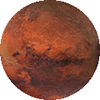

# ARN-Skin - Explore 7 space-themed skins + customization to enhance your IDE.

  

 

---

--> 💬 [🇬🇧 English](#en) | [🇫🇷 Français](#fr) | [🇨🇳 中文](#cn) | [🇪🇸 Español](#es) | [🇸🇦 العربية](#ar) | [🇹🇭 ภาษาไทย](#th) <--

---

 

## 🇬🇧 English

 

**7 premium space themes + customization** for Antigravity IDE, VSCode, Cursor, VSCodium, Windsurf...

📦 **Zero dependencies**: 100% native JavaScript, readable and auditable.

---

  <h4> <a href="https://jzbakh.github.io/antigravity-arn-skin/html_presentation/"> Visualize Markdown, Python, TypeScript, Rust, CSS, HTML, JSON, Shell, and SQL syntax </a></h4>

 

| Theme | Style | Description |
|:---|:---|:---|
| [ **Spaceport**](https://jzbakh.github.io/antigravity-arn-skin/html_presentation/index.html) | *Tungsten Grid* | Industrial charcoal gray with golden accents |
| [ **Nebula**](https://jzbakh.github.io/antigravity-arn-skin/html_presentation/index.html) | *Amethyst Void* | Violet, magenta, and cyan cosmos |
| [ **Neptune**](https://jzbakh.github.io/antigravity-arn-skin/html_presentation/index.html) | *Glacial Navy* | Teal ocean ice |
| [ **Uranus**](https://jzbakh.github.io/antigravity-arn-skin/html_presentation/index.html) | *Glacial Teal* | Teal and ultramarine blue variant |
| [ **Io**](https://jzbakh.github.io/antigravity-arn-skin/html_presentation/index.html) | *Acid Haze* | Neon lime green on deep black |
| [ **Jupiter**](https://jzbakh.github.io/antigravity-arn-skin/html_presentation/index.html) | *Amber Light* | Light parchment (the only light theme) |
| [ **Mars**](https://jzbakh.github.io/antigravity-arn-skin/html_presentation/index.html) | *Amber Storm* | Burnt orange on red earth |

 

---

### **Features:**

🚀 **Change Theme:** Instantly switch between the 7 themes via the extension menu by clicking on `Skin` in the status bar. 

*Customize in real-time (400ms delay) via the IDE's native color picker:*

⚡ **Quick Customization:** Edit only **12 key colors**, the extension automatically generates the ~250 derived UI colors!

🌈 **Advanced: UI Colors:** Granular control over every visual element (tabs, sidebar, activity bar, terminal...).

⌨️ **Advanced: Syntax Colors:** Adjust the syntax highlighting of your code by directly editing semantic tokens and TextMate rules.

♻️ **Reset:** Revert all modifications to restore the original theme at any time.

---

## 🚀 Installation

🌍 **README in 6 languages**: no heavy translation framework bundled in the extension.

<b>🔌 Via the IDE interface (Recommended)</b>

 

Works on Antigravity IDE, VSCode, Cursor, Windsurf, VSCodium, and other forks (that use the Microsoft Marketplace or Open VSX).

1. Open the **Extensions** view (`Ctrl+Shift+X`).
2. Search for `ARN-Skin`.
3. Click **Install** and enable the extension.

<b>💻 Installation via VSIX</b>

 

1. Download the [`antigravity-arn-skin.vsix`](https://github.com/jzbakh/antigravity-arn-skin/releases/latest/download/antigravity-arn-skin.vsix) file.
2. In Antigravity IDE, open the Extensions view (`Ctrl+Shift+X`).
3. Click the "..." menu (Views and More Actions) at the top of the sidebar.
4. Select **Install from VSIX...**
5. Choose the `antigravity-arn-skin.vsix` file and enable the extension.

<b>🔧 Manual Installation</b>

 

100% native JavaScript extension — no build step. The code is readable and auditable.

1. Create a folder named `arn-skin`, then download and place the `schemas`, `themes`, and `media` folders inside it, along with the `extension.js`, `package.json`, and `README.md` files.
2. Copy this folder into your IDE's extensions directory (example for Antigravity IDE):
   - **Windows**: `%USERPROFILE%\.antigravity\extensions\`
   - **macOS/Linux**: `~/.antigravity/extensions/`
3. Restart the IDE and enable the extension.

---

## 🩵 Support the project

 

  <b>💫 Like this project? Leave a ⭐ on GitHub to support it!</b>

  

 

  

---

### ☕ Financial support

If you would like to financially contribute to the development and future updates, you can buy me a coffee or donate in cryptocurrencies. Thank you so much! 🫶

**Cryptocurrency donations:**

<b>₿ Bitcoin (BTC)</b>

 

`bc1q4zu08uxpfra9aecp28x6zelg23qdcdeg680hlg`

<b>Ethereum (ETH) & ERC-20 Tokens</b>

 

`0xdc593BfaD6Be146400B713c2787DCCb9392AC206`

<b>Solana (SOL)</b>

 

`FwBu1oqSCdfDvvFhy3crYBkgzjDuwDcU5gxXzVCqxTn9`

---

  <b>Made with 🩵 by <a href="https://github.com/jzbakh">jzbakh</a></b>

---

 

## 🇫🇷 Français

 

**7 thèmes spatiaux premium + personnalisation** pour Antigravity IDE, VSCode, Cursor, VSCodium, Windsurf...

📦 **Zéro dépendance** : 100 % JavaScript natif, lisible et auditable.

---

  <h4> <a href="https://jzbakh.github.io/antigravity-arn-skin/html_presentation/"> Visualisez les syntaxes Markdown, Python, Typescript, Rust, CSS, HTML, JSON, Shell et SQL </a></h4>

 

| Thème | Style | Description |
|:---|:---|:---|
| [ **Spaceport**](https://jzbakh.github.io/antigravity-arn-skin/html_presentation/index.html) | *Tungsten Grid* | Gris anthracite industriel aux accents dorés |
| [ **Nebula**](https://jzbakh.github.io/antigravity-arn-skin/html_presentation/index.html) | *Amethyst Void* | Cosmos violet, magenta et cyan |
| [ **Neptune**](https://jzbakh.github.io/antigravity-arn-skin/html_presentation/index.html) | *Glacial Navy* | Glace océanique bleu sarcelle (teal) |
| [ **Uranus**](https://jzbakh.github.io/antigravity-arn-skin/html_presentation/index.html) | *Glacial Teal* | Variante sarcelle et bleu outremer |
| [ **Io**](https://jzbakh.github.io/antigravity-arn-skin/html_presentation/index.html) | *Acid Haze* | Vert lime néon sur fond noir profond |
| [ **Jupiter**](https://jzbakh.github.io/antigravity-arn-skin/html_presentation/index.html) | *Amber Light* | Parchemin clair (le seul thème clair) |
| [ **Mars**](https://jzbakh.github.io/antigravity-arn-skin/html_presentation/index.html) | *Amber Storm* | Orange brûlé sur terres rouges |

 

---

### **Fonctionnalités :**

🚀 **Change Theme (Changer de thème) :** Basculez instantanément entre les 7 thèmes via le menu de l'extension en cliquant sur `Skin` dans la barre d'état. 

*Personnalisez en temps réel (délai de 400 ms) via le sélecteur de couleurs natif de l'IDE :*

⚡ **Quick Customization (Personnalisation rapide) :** Éditez seulement **12 couleurs clés**, l'extension génère automatiquement les ~250 couleurs d'interface dérivées !

🌈 **Advanced: UI Colors (Couleurs de l'interface) :** Contrôle granulaire de chaque élément visuel (onglets, barre latérale, barre d'activité, terminal…).

⌨️ **Advanced: Syntax Colors (Couleurs de syntaxe) :** Ajustez la coloration syntaxique de votre code en éditant directement les tokens sémantiques et les règles TextMate.

♻️ **Reset (Réinitialisation) :** Annulez toutes les modifications pour restaurer le thème d'origine à tout moment.

---

## 🚀 Installation

🌍 **README en 6 langues** : sans framework de traduction lourd embarqué dans l'extension.

<b>🔌 Via l'interface de l'IDE (Recommandé)</b>

 

Fonctionne sur Antigravity IDE, VSCode, Cursor, Windsurf, VSCodium et autres forks (qui utilisent le Microsoft Marketplace ou Open VSX).

1. Ouvrez la vue **Extensions** (`Ctrl+Shift+X`).
2. Recherchez `ARN-Skin`.
3. Cliquez sur **Installer** et activez l'extension.

<b>💻 Installation via VSIX</b>

 

1. Téléchargez le fichier [`antigravity-arn-skin.vsix`](https://github.com/jzbakh/antigravity-arn-skin/releases/latest/download/antigravity-arn-skin.vsix).
2. Dans Antigravity IDE, ouvrez la vue des Extensions (`Ctrl+Shift+X`).
3. Cliquez sur le menu "..." (Vues et plus d'actions) en haut de la barre latérale.
4. Sélectionnez **Installer à partir d'un VSIX...**
5. Choisissez le fichier `antigravity-arn-skin.vsix` et activez l'extension.

<b>🔧 Installation manuelle</b>

 

Extension 100 % JavaScript natif — aucune étape de build. Le code est lisible et auditable.

1. Créez un dossier nommé `arn-skin`, puis téléchargez et placez-y les dossiers `schemas`, `themes` et `media`, ainsi que les fichiers `extension.js`, `package.json` et `README.md`.
2. Copiez ce dossier dans le répertoire des extensions de votre IDE (exemple pour Antigravity IDE) :
   - **Windows** : `%USERPROFILE%\.antigravity\extensions\`
   - **macOS/Linux** : `~/.antigravity/extensions/`
3. Redémarrez l'IDE et activez l'extension.

---

## 🩵 Soutenir le projet

 

  <b>💫 Ce projet vous plaît ? Laissez une ⭐ sur GitHub pour soutenir le projet !</b>

  

 

  

---

### ☕ Soutien financier

Si vous souhaitez contribuer financièrement au développement et aux futures mises à jour, vous pouvez m'offrir un café ou faire un don en cryptomonnaies. Merci infiniment ! 🫶

**Dons en cryptomonnaies :**

<b>₿ Bitcoin (BTC)</b>

 

`bc1q4zu08uxpfra9aecp28x6zelg23qdcdeg680hlg`

<b>Ethereum (ETH) & ERC-20 Tokens</b>

 

`0xdc593BfaD6Be146400B713c2787DCCb9392AC206`

<b>Solana (SOL)</b>

 

`FwBu1oqSCdfDvvFhy3crYBkgzjDuwDcU5gxXzVCqxTn9`

---

  <b>Made with 🩵 by <a href="https://github.com/jzbakh">jzbakh</a></b>

---

 

## 🇨🇳 中文

 

**7 款高级太空主题 + 自定义功能**，适用于 Antigravity IDE, VSCode, Cursor, VSCodium, Windsurf...

📦 **零依赖 (Zero dependencies)** : 100% 原生 JavaScript，代码可读且可审计。

---

  <h4> <a href="https://jzbakh.github.io/antigravity-arn-skin/html_presentation/"> 预览 Markdown, Python, TypeScript, Rust, CSS, HTML, JSON, Shell 和 SQL 语法</a></h4>

 

| 主题 | 风格 | 描述 |
|:---|:---|:---|
| [ **Spaceport**](https://jzbakh.github.io/antigravity-arn-skin/html_presentation/index.html) | *Tungsten Grid* | 带有金色点缀的工业炭灰色 |
| [ **Nebula**](https://jzbakh.github.io/antigravity-arn-skin/html_presentation/index.html) | *Amethyst Void* | 紫色、洋红色与青色的宇宙 |
| [ **Neptune**](https://jzbakh.github.io/antigravity-arn-skin/html_presentation/index.html) | *Glacial Navy* | Teal色的海洋冰 |
| [ **Uranus**](https://jzbakh.github.io/antigravity-arn-skin/html_presentation/index.html) | *Glacial Teal* | Teal色与群青蓝变体 |
| [ **Io**](https://jzbakh.github.io/antigravity-arn-skin/html_presentation/index.html) | *Acid Haze* | 深邃黑色上的霓虹青柠绿 |
| [ **Jupiter**](https://jzbakh.github.io/antigravity-arn-skin/html_presentation/index.html) | *Amber Light* | 浅色羊皮纸（唯一的浅色主题） |
| [ **Mars**](https://jzbakh.github.io/antigravity-arn-skin/html_presentation/index.html) | *Amber Storm* | 红土地上的焦橙色 |

 

---

### **功能特性：**

🚀 **Change Theme (更改主题) :** 通过点击状态栏中的 `Skin`，可以在扩展菜单中瞬间切换 7 款主题。 

*通过 IDE 原生颜色选择器实时自定义（400 毫秒延迟）：*

⚡ **Quick Customization (快速自定义) :** 仅需编辑 **12 种关键颜色**，扩展程序会自动生成约 250 种派生的 UI 颜色！

🌈 **Advanced: UI Colors (高级：UI 颜色) :** 对每个视觉元素（选项卡、侧边栏、活动栏、终端等）进行细粒度控制。

⌨️ **Advanced: Syntax Colors (高级：语法颜色) :** 通过直接编辑语义 token 和 TextMate 规则来调整代码的语法高亮。

♻️ **Reset (重置) :** 随时撤销所有修改以恢复原始主题。

---

## 🚀 安装

🌍 **支持 6 种语言的 README**：扩展中未内置臃肿的翻译框架。

<b>🔌 通过 IDE 界面（推荐）</b>

 

支持 Antigravity IDE, VSCode, Cursor, Windsurf, VSCodium 及其他分支（使用 Microsoft Marketplace 或 Open VSX 的版本）。

1. 打开 **Extensions (扩展)** 视图 (`Ctrl+Shift+X`)。
2. 搜索 `ARN-Skin`。
3. 点击 **Install (安装)** 并启用扩展。

<b>💻 通过 VSIX 安装</b>

 

1. 下载 [`antigravity-arn-skin.vsix`](https://github.com/jzbakh/antigravity-arn-skin/releases/latest/download/antigravity-arn-skin.vsix) 文件。
2. 在 Antigravity IDE 中，打开 Extensions (扩展) 视图 (`Ctrl+Shift+X`)。
3. 点击侧边栏顶部的 "..." 菜单（视图和更多操作）。
4. 选择 **Install from VSIX... (从 VSIX 安装...)**
5. 选择 `antigravity-arn-skin.vsix` 文件并启用扩展。

<b>🔧 手动安装</b>

 

100% 原生 JavaScript 扩展 — 无需 build 步骤。代码可读且可审计。

1. 创建一个名为 `arn-skin` 的文件夹，然后下载并将 `schemas`、`themes` 和 `media` 文件夹，以及 `extension.js`、`package.json` 和 `README.md` 文件放入其中。
2. 将此文件夹复制到您的 IDE 扩展目录中（以 Antigravity IDE 为例）：
   - **Windows**：`%USERPROFILE%\.antigravity\extensions\`
   - **macOS/Linux**：`~/.antigravity\extensions\`
3. 重启 IDE 并启用扩展。

---

## 🩵 支持项目

 

  <b>💫 喜欢这个项目吗？在 GitHub 上点颗 ⭐ 以表支持！</b>

  

 

  

---

### ☕ 资金支持

如果您希望在资金上支持本项目的开发与未来的更新，您可以请我喝杯咖啡或使用加密货币进行捐赠。非常感谢！🫶

**加密货币捐赠：**

<b>₿ Bitcoin (比特币, BTC)</b>

 

`bc1q4zu08uxpfra9aecp28x6zelg23qdcdeg680hlg`

<b>Ethereum (以太坊, ETH) & ERC-20 代币</b>

 

`0xdc593BfaD6Be146400B713c2787DCCb9392AC206`

<b>Solana (索拉纳, SOL)</b>

 

`FwBu1oqSCdfDvvFhy3crYBkgzjDuwDcU5gxXzVCqxTn9`

---

  <b>Made with 🩵 by <a href="https://github.com/jzbakh">jzbakh</a></b>

---

 

## 🇪🇸 Español

 

**7 temas espaciales premium + personalización** para Antigravity IDE, VSCode, Cursor, VSCodium, Windsurf...

📦 **Cero dependencias** : 100 % JavaScript nativo, legible y auditable.

---

  <h4> <a href="https://jzbakh.github.io/antigravity-arn-skin/html_presentation/"> Visualiza las sintaxis Markdown, Python, TypeScript, Rust, CSS, HTML, JSON, Shell y SQL </a></h4>

 

| Tema | Estilo | Descripción |
|:---|:---|:---|
| [ **Spaceport**](https://jzbakh.github.io/antigravity-arn-skin/html_presentation/index.html) | *Tungsten Grid* | Gris antracita industrial con acentos dorados |
| [ **Nebula**](https://jzbakh.github.io/antigravity-arn-skin/html_presentation/index.html) | *Amethyst Void* | Cosmos violeta, magenta y cian |
| [ **Neptune**](https://jzbakh.github.io/antigravity-arn-skin/html_presentation/index.html) | *Glacial Navy* | Hielo oceánico verde azulado (teal) |
| [ **Uranus**](https://jzbakh.github.io/antigravity-arn-skin/html_presentation/index.html) | *Glacial Teal* | Variante verde azulado y azul ultramar |
| [ **Io**](https://jzbakh.github.io/antigravity-arn-skin/html_presentation/index.html) | *Acid Haze* | Verde lima neón sobre fondo negro profundo |
| [ **Jupiter**](https://jzbakh.github.io/antigravity-arn-skin/html_presentation/index.html) | *Amber Light* | Pergamino claro (el único tema claro) |
| [ **Mars**](https://jzbakh.github.io/antigravity-arn-skin/html_presentation/index.html) | *Amber Storm* | Naranja quemado sobre tierras rojas |

 

---

### **Características :**

🚀 **Change Theme (Cambiar tema):** Cambia instantáneamente entre los 7 temas a través del menú de la extensión haciendo clic en `Skin` en la barra de estado. 

*Personaliza en tiempo real (retraso de 400 ms) a través del selector de colores nativo del IDE:*

⚡ **Quick Customization (Personalización rápida):** Edita solo **12 colores clave**, ¡la extensión genera automáticamente los ~250 colores derivados de la UI!

🌈 **Advanced: UI Colors (Colores de la interfaz):** Control granular de cada elemento visual (pestañas, barra lateral, barra de actividad, terminal…).

⌨️ **Advanced: Syntax Colors (Colores de sintaxis):** Ajusta el resaltado de sintaxis de tu código editando directamente los tokens semánticos y las reglas TextMate.

♻️ **Reset (Restablecer):** Deshaz todas las modificaciones para restaurar el tema original en cualquier momento.

---

## 🚀 Instalación

🌍 **README en 6 idiomas**: sin framework de traducción pesado integrado en la extensión.

<b>🔌 A través de la interfaz del IDE (Recomendado)</b>

 

Funciona en Antigravity IDE, VSCode, Cursor, Windsurf, VSCodium y otros forks (que usan el Microsoft Marketplace u Open VSX).

1. Abre la vista de **Extensiones** (`Ctrl+Shift+X`).
2. Busca `ARN-Skin`.
3. Haz clic en **Instalar** y activa la extensión.

<b>💻 Instalación a través de VSIX</b>

 

1. Descarga el archivo [`antigravity-arn-skin.vsix`](https://github.com/jzbakh/antigravity-arn-skin/releases/latest/download/antigravity-arn-skin.vsix).
2. En Antigravity IDE, abre la vista de Extensiones (`Ctrl+Shift+X`).
3. Haz clic en el menú "..." (Vistas y más acciones) en la parte superior de la barra lateral.
4. Selecciona **Instalar desde VSIX...**
5. Elige el archivo `antigravity-arn-skin.vsix` y activa la extensión.

<b>🔧 Instalación manual</b>

 

Extensión 100 % JavaScript nativo — sin paso de build. El código es legible y auditable.

1. Crea una carpeta llamada `arn-skin`, luego descarga y coloca las carpetas `schemas`, `themes` y `media` dentro de ella, junto con los archivos `extension.js`, `package.json` y `README.md`.
2. Copia esta carpeta en el directorio de extensiones de tu IDE (ejemplo para Antigravity IDE):
   - **Windows**: `%USERPROFILE%\.antigravity\extensions\`
   - **macOS/Linux**: `~/.antigravity/extensions/`
3. Reinicia el IDE y activa la extensión.

---

## 🩵 Apoyar el proyecto

 

  <b>💫 ¿Te gusta este proyecto? ¡Deja una ⭐ en GitHub para apoyarlo!</b>

  

 

  

---

### ☕ Apoyo financiero

Si deseas contribuir financieramente al desarrollo y a las futuras actualizaciones, puedes invitarme a un café o hacer una donación en criptomonedas. ¡Muchas gracias! 🫶

**Donaciones en criptomonedas:**

<b>₿ Bitcoin (BTC)</b>

 

`bc1q4zu08uxpfra9aecp28x6zelg23qdcdeg680hlg`

<b>Ethereum (ETH) & Tokens ERC-20</b>

 

`0xdc593BfaD6Be146400B713c2787DCCb9392AC206`

<b>Solana (SOL)</b>

 

`FwBu1oqSCdfDvvFhy3crYBkgzjDuwDcU5gxXzVCqxTn9`

---

  <b>Made with 🩵 by <a href="https://github.com/jzbakh">jzbakh</a></b>

---

 

## 🇸🇦 العربية

 

**7 سمات فضائية متميزة + إمكانية التخصيص** لبيئات التطوير Antigravity IDE، VSCode، Cursor، VSCodium، Windsurf...

📦 **بدون تبعيات (Zero dependencies)** : 100% JavaScript أصلي، كود مقروء وقابل للتدقيق.

---

  <h4> <a href="https://jzbakh.github.io/antigravity-arn-skin/html_presentation/"> قم بمعاينة بناء الجملة (Syntax) لـ Markdown و Python و TypeScript و Rust و CSS و HTML و JSON و Shell و SQL </a></h4>

 

| السمة | النمط | الوصف |
|:---|:---|:---|
| [**Spaceport** ](https://jzbakh.github.io/antigravity-arn-skin/html_presentation/index.html) | *Tungsten Grid* | رمادي فحمي صناعي مع لمسات ذهبية |
| [**Nebula** ](https://jzbakh.github.io/antigravity-arn-skin/html_presentation/index.html) | *Amethyst Void* | كون بنفسجي، أرجواني، وسماوي |
| [**Neptune** ](https://jzbakh.github.io/antigravity-arn-skin/html_presentation/index.html) | *Glacial Navy* | جليد محيطي أزرق مخضر (teal) |
| [**Uranus** ](https://jzbakh.github.io/antigravity-arn-skin/html_presentation/index.html) | *Glacial Teal* | نسخة باللون الأزرق المخضر والأزرق اللازوردي |
| [**Io** ](https://jzbakh.github.io/antigravity-arn-skin/html_presentation/index.html) | *Acid Haze* | أخضر ليموني نيون على خلفية سوداء عميقة |
| [**Jupiter** ](https://jzbakh.github.io/antigravity-arn-skin/html_presentation/index.html) | *Amber Light* | ورق رقي فاتح (السمة الفاتحة الوحيدة) |
| [**Mars** ](https://jzbakh.github.io/antigravity-arn-skin/html_presentation/index.html) | *Amber Storm* | برتقالي محروق على أراضٍ حمراء |

 

---

### **الميزات :**

🚀 **Change Theme (تغيير السمة):** قم بالتبديل فورًا بين السمات السبع عبر قائمة الإضافة بالضغط على `Skin` في شريط الحالة. 

*التخصيص في الوقت الفعلي (بتأخير 400 مللي ثانية) عبر منتقي الألوان المدمج في بيئة التطوير (IDE):*

⚡ **Quick Customization (تخصيص سريع):** قم بتعديل **12 لونًا رئيسيًا** فقط، وستقوم الإضافة تلقائيًا بإنشاء حوالي 250 لونًا مشتقًا لواجهة المستخدم (UI)!

🌈 **Advanced: UI Colors (ألوان واجهة المستخدم):** تحكم دقيق في كل عنصر مرئي (علامات التبويب، الشريط الجانبي، شريط النشاط، الطرفية...).

⌨️ **Advanced: Syntax Colors (ألوان بناء الجملة):** قم بضبط تمييز بناء الجملة (Syntax highlighting) لكودك عن طريق التعديل المباشر على الرموز الدلالية (semantic tokens) وقواعد TextMate.

♻️ **Reset (إعادة تعيين):** تراجع عن جميع التعديلات لاستعادة السمة الأصلية في أي وقت.

---

## 🚀 التثبيت

🌍 **README بـ 6 لغات**: بدون دمج إطارات ترجمة ثقيلة داخل الإضافة.

<b>🔌 عبر واجهة بيئة التطوير (موصى به)</b>

 

يعمل على Antigravity IDE و VSCode و Cursor و Windsurf و VSCodium وغيرها من النسخ المشتقة (التي تستخدم Microsoft Marketplace أو Open VSX).

1. افتح عرض **الإضافات (Extensions)** (`Ctrl+Shift+X`).
2. ابحث عن `ARN-Skin`.
3. انقر على **تثبيت (Install)** وقم بتفعيل الإضافة.

<b>💻 التثبيت عبر VSIX</b>

 

1. قم بتنزيل ملف [`antigravity-arn-skin.vsix`](https://github.com/jzbakh/antigravity-arn-skin/releases/latest/download/antigravity-arn-skin.vsix).
2. في بيئة تطوير Antigravity IDE، افتح عرض الإضافات (`Ctrl+Shift+X`).
3. انقر على قائمة "..." (طرق العرض والمزيد من الإجراءات) في أعلى الشريط الجانبي.
4. حدد **Install from VSIX...**
5. اختر ملف `antigravity-arn-skin.vsix` وقم بتفعيل الإضافة.

<b>🔧 التثبيت اليدوي</b>

 

إضافة مبنية بنسبة 100% بـ JavaScript أصلي — بدون خطوات بناء (build). الكود مقروء وقابل للتدقيق.

1. قم بإنشاء مجلد باسم `arn-skin`، ثم قم بتنزيل ووضع المجلدات `schemas` و `themes` و `media` بداخله، إلى جانب ملفات `extension.js` و `package.json` و `README.md`.
2. انسخ هذا المجلد إلى مسار الإضافات الخاص ببيئة التطوير الخاصة بك (مثال لـ Antigravity IDE):
   - **نظام Windows**: `%USERPROFILE%\.antigravity\extensions\`
   - **نظام macOS/Linux**: `~/.antigravity/extensions/`
3. أعد تشغيل بيئة التطوير (IDE) وقم بتفعيل الإضافة.

---

## 🩵 دعم المشروع

 

  <b>💫 هل أعجبك هذا المشروع؟ اترك ⭐ على GitHub لدعمه!</b>

  

 

  

---

### ☕ الدعم المالي

إذا كنت ترغب في المساهمة ماليًا في التطوير والتحديثات المستقبلية، يمكنك أن تشتري لي قهوة أو التبرع بالعملات الرقمية المشفرة. شكرًا جزيلاً لك! 🫶

**التبرعات بالعملات الرقمية المشفرة:**

<b>₿ Bitcoin (بيتكوين, BTC)</b>

 

`bc1q4zu08uxpfra9aecp28x6zelg23qdcdeg680hlg`

<b>Ethereum (إيثيريوم, ETH) & ERC-20 Tokens (رموز ERC-20)</b>

 

`0xdc593BfaD6Be146400B713c2787DCCb9392AC206`

<b>Solana (سولانا, SOL)</b>

 

`FwBu1oqSCdfDvvFhy3crYBkgzjDuwDcU5gxXzVCqxTn9`

---

  <b>صُنع بـ 🩵 بواسطة <a href="https://github.com/jzbakh">jzbakh</a></b>

---

 

## 🇹🇭 ภาษาไทย

 

**7 ธีมอวกาศระดับพรีเมียม + ปรับแต่งได้อย่างอิสระ** สำหรับ Antigravity IDE, VSCode, Cursor, VSCodium, Windsurf...

📦 **ไม่มี Dependency (Zero dependencies)** : เขียนด้วย JavaScript แบบเนทีฟ 100% โค้ดอ่านง่ายและสามารถตรวจสอบได้

---

  <h4> <a href="https://jzbakh.github.io/antigravity-arn-skin/html_presentation/"> แสดงตัวอย่าง Syntax ของ Markdown, Python, TypeScript, Rust, CSS, HTML, JSON, Shell และ SQL </a></h4>

 

| ธีม | สไตล์ | คำอธิบาย |
|:---|:---|:---|
| [ **Spaceport**](https://jzbakh.github.io/antigravity-arn-skin/html_presentation/index.html) | *Tungsten Grid* | สีเทาชาร์โคลแบบอินดัสเตรียลพร้อมลูกเล่นสีทอง |
| [ **Nebula**](https://jzbakh.github.io/antigravity-arn-skin/html_presentation/index.html) | *Amethyst Void* | ห้วงจักรวาลสีม่วง สีบานเย็น และสีฟ้าไซแอน |
| [ **Neptune**](https://jzbakh.github.io/antigravity-arn-skin/html_presentation/index.html) | *Glacial Navy* | สีน้ำแข็งในมหาสมุทรโทนเขียวอมฟ้า (teal) |
| [ **Uranus**](https://jzbakh.github.io/antigravity-arn-skin/html_presentation/index.html) | *Glacial Teal* | ธีมทางเลือกสีเขียวอมฟ้าและสีน้ำเงินอุลตรามารีน |
| [ **Io**](https://jzbakh.github.io/antigravity-arn-skin/html_presentation/index.html) | *Acid Haze* | สีเขียวมะนาวนีออนบนพื้นหลังสีดำสนิท |
| [ **Jupiter**](https://jzbakh.github.io/antigravity-arn-skin/html_presentation/index.html) | *Amber Light* | สีแผ่นกระดาษพาร์ชเมนต์สว่าง (ธีมสว่างเพียงหนึ่งเดียว) |
| [ **Mars**](https://jzbakh.github.io/antigravity-arn-skin/html_presentation/index.html) | *Amber Storm* | สีส้มอิฐบนพื้นดินสีแดง |

 

---

### **คุณสมบัติ :**

🚀 **Change Theme (เปลี่ยนธีม):** สลับใช้งานระหว่าง 7 ธีมได้ทันทีผ่านเมนูของส่วนขยาย เพียงคลิกที่ `Skin` บนแถบสถานะ (status bar)

*ปรับแต่งแบบเรียลไทม์ (ความหน่วง 400 มิลลิวินาที) ผ่านเครื่องมือเลือกสีเริ่มต้นของ IDE:*

⚡ **Quick Customization (ปรับแต่งอย่างรวดเร็ว):** แก้ไขเพียง **12 สีหลัก** ส่วนขยายจะสร้างสีอินเทอร์เฟซ (UI) ที่เกี่ยวข้องกว่า 250 สีให้โดยอัตโนมัติ!

🌈 **Advanced: UI Colors (สีอินเทอร์เฟซ):** ควบคุมทุกองค์ประกอบของภาพได้อย่างละเอียด (แท็บ แถบด้านข้าง แถบกิจกรรม เทอร์มินัล...)

⌨️ **Advanced: Syntax Colors (สีของไวยากรณ์):** ปรับแต่งการเน้นสีไวยากรณ์ (Syntax highlighting) ของโค้ดโดยการแก้ไขโทเค็นความหมายและกฎ TextMate ได้โดยตรง

♻️ **Reset (รีเซ็ต):** ย้อนกลับการแก้ไขทั้งหมดเพื่อคืนค่าเป็นธีมดั้งเดิมได้ทุกเมื่อ

---

## 🚀 การติดตั้ง

🌍 **README มี 6 ภาษา**: ไม่มีเฟรมเวิร์กการแปลภาษาที่หนักเครื่องฝังมากับส่วนขยาย

<b>🔌 ผ่านหน้าต่างอินเทอร์เฟซของ IDE (แนะนำ)</b>

 

รองรับการทำงานบน Antigravity IDE, VSCode, Cursor, Windsurf, VSCodium และเวอร์ชันแยกอื่นๆ (ที่ใช้งาน Microsoft Marketplace หรือ Open VSX)

1. เปิดหน้ามุมมอง **ส่วนขยาย (Extensions)** (`Ctrl+Shift+X`)
2. ค้นหา `ARN-Skin`
3. คลิก **ติดตั้ง (Install)** และเปิดใช้งานส่วนขยาย

<b>💻 การติดตั้งผ่าน VSIX</b>

 

1. ดาวน์โหลดไฟล์ [`antigravity-arn-skin.vsix`](https://github.com/jzbakh/antigravity-arn-skin/releases/latest/download/antigravity-arn-skin.vsix)
2. ใน Antigravity IDE ให้เปิดหน้ามุมมองส่วนขยาย (`Ctrl+Shift+X`)
3. คลิกที่เมนู "..." (Views and More Actions) ที่ด้านบนของแถบด้านข้าง
4. เลือก **Install from VSIX...**
5. เลือกไฟล์ `antigravity-arn-skin.vsix` และเปิดใช้งานส่วนขยาย

<b>🔧 การติดตั้งแบบกำหนดเอง</b>

 

ส่วนขยายเป็น JavaScript แบบเนทีฟ 100% — ไม่มีขั้นตอนการบิลด์ โค้ดอ่านง่ายและสามารถตรวจสอบได้

1. สร้างโฟลเดอร์ชื่อ `arn-skin` จากนั้นดาวน์โหลดและวางโฟลเดอร์ `schemas`, `themes` และ `media` ไว้ด้านใน พร้อมกับไฟล์ `extension.js`, `package.json` และ `README.md`
2. คัดลอกโฟลเดอร์นี้ไปยังไดเรกทอรีส่วนขยายของ IDE ของคุณ (ตัวอย่างสำหรับ Antigravity IDE):
   - **ระบบ Windows**: `%USERPROFILE%\.antigravity\extensions\`
   - **ระบบ macOS/Linux**: `~/.antigravity/extensions/`
3. รีสตาร์ท IDE และเปิดใช้งานส่วนขยาย

---

## 🩵 สนับสนุนโครงการ

 

  <b>💫 หากคุณชื่นชอบโครงการนี้ ฝากกด ⭐ บน GitHub เพื่อเป็นกำลังใจให้เรา!</b>

  

 

  

---

### ☕ การสนับสนุนทางการเงิน

หากคุณต้องการมีส่วนร่วมสนับสนุนทุนสำหรับการพัฒนาและอัปเดตฟีเจอร์ในอนาคต คุณสามารถเลี้ยงกาแฟฉัน หรือบริจาคผ่านสกุลเงินดิจิทัลได้ ขอขอบคุณเป็นอย่างยิ่ง! 🫶

**การบริจาคด้วยสกุลเงินคริปโต:**

<b>₿ Bitcoin (บิตคอยน์, BTC)</b>

 

`bc1q4zu08uxpfra9aecp28x6zelg23qdcdeg680hlg`

<b>Ethereum (อีเธอเรียม, ETH) & ERC-20 Tokens (โทเคน ERC-20)</b>

 

`0xdc593BfaD6Be146400B713c2787DCCb9392AC206`

<b>Solana (โซลานา, SOL)</b>

 

`FwBu1oqSCdfDvvFhy3crYBkgzjDuwDcU5gxXzVCqxTn9`

---

  <b>สร้างสรรค์ด้วย 🩵 โดย <a href="https://github.com/jzbakh">jzbakh</a></b>

---